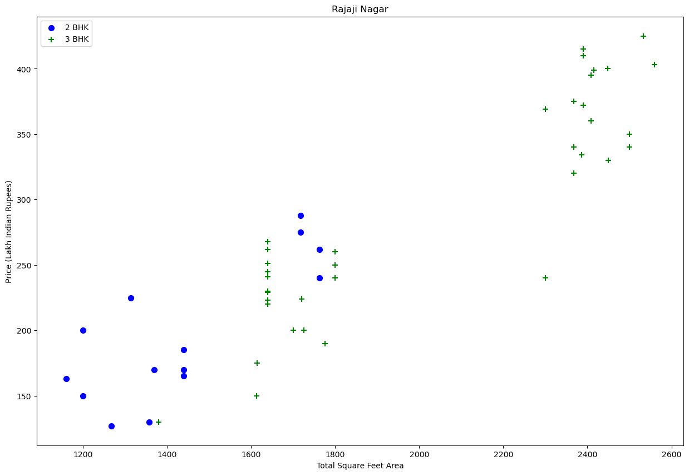
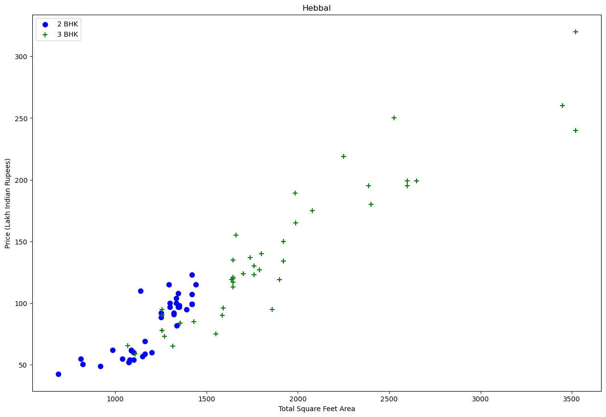
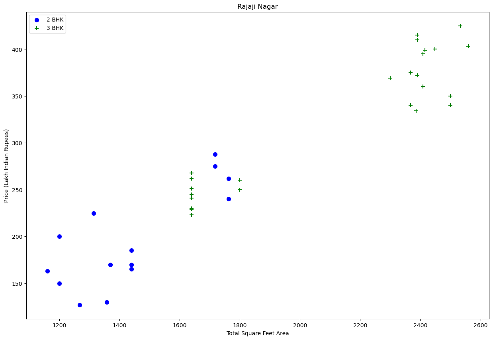
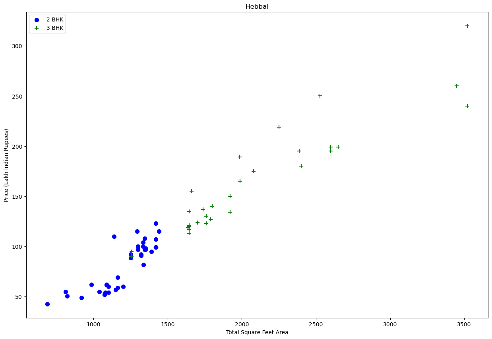
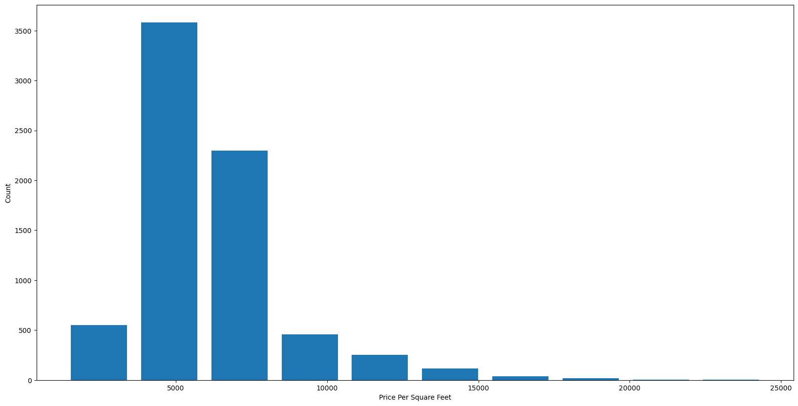
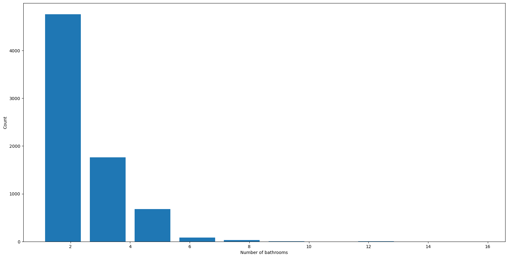

<h1><p style="text-align:center; color:purple;">Data Science Regression Project: Predicting Home Prices in Banglore</p></h1>

Dataset is downloaded from here: https://www.kaggle.com/amitabhajoy/bengaluru-house-price-data


```python
import pandas as pd
import numpy as np
from matplotlib import pyplot as plt
%matplotlib inline
import matplotlib 
matplotlib.rcParams["figure.figsize"] = (20,10)

import warnings
warnings.filterwarnings('ignore')
```

## Data Load: Load banglore home prices into a dataframe


```python
df1 = pd.read_csv("Data/Bengaluru_House_Data.csv")
df1.head()
```


<div>
<style scoped>
    .dataframe tbody tr th:only-of-type {
        vertical-align: middle;
    }

    .dataframe tbody tr th {
        vertical-align: top;
    }

    .dataframe thead th {
        text-align: right;
    }
</style>
<table border="1" class="dataframe">
  <thead>
    <tr style="text-align: right;">
      <th></th>
      <th>area_type</th>
      <th>availability</th>
      <th>location</th>
      <th>size</th>
      <th>society</th>
      <th>total_sqft</th>
      <th>bath</th>
      <th>balcony</th>
      <th>price</th>
    </tr>
  </thead>
  <tbody>
    <tr>
      <th>0</th>
      <td>Super built-up  Area</td>
      <td>19-Dec</td>
      <td>Electronic City Phase II</td>
      <td>2 BHK</td>
      <td>Coomee</td>
      <td>1056</td>
      <td>2.0</td>
      <td>1.0</td>
      <td>39.07</td>
    </tr>
    <tr>
      <th>1</th>
      <td>Plot  Area</td>
      <td>Ready To Move</td>
      <td>Chikka Tirupathi</td>
      <td>4 Bedroom</td>
      <td>Theanmp</td>
      <td>2600</td>
      <td>5.0</td>
      <td>3.0</td>
      <td>120.00</td>
    </tr>
    <tr>
      <th>2</th>
      <td>Built-up  Area</td>
      <td>Ready To Move</td>
      <td>Uttarahalli</td>
      <td>3 BHK</td>
      <td>NaN</td>
      <td>1440</td>
      <td>2.0</td>
      <td>3.0</td>
      <td>62.00</td>
    </tr>
    <tr>
      <th>3</th>
      <td>Super built-up  Area</td>
      <td>Ready To Move</td>
      <td>Lingadheeranahalli</td>
      <td>3 BHK</td>
      <td>Soiewre</td>
      <td>1521</td>
      <td>3.0</td>
      <td>1.0</td>
      <td>95.00</td>
    </tr>
    <tr>
      <th>4</th>
      <td>Super built-up  Area</td>
      <td>Ready To Move</td>
      <td>Kothanur</td>
      <td>2 BHK</td>
      <td>NaN</td>
      <td>1200</td>
      <td>2.0</td>
      <td>1.0</td>
      <td>51.00</td>
    </tr>
  </tbody>
</table>
</div>


```python
df1.shape
```


    (13320, 9)


```python
df1.columns
```


    Index(['area_type', 'availability', 'location', 'size', 'society',
           'total_sqft', 'bath', 'balcony', 'price'],
          dtype='object')


```python
df1.columns
```


    Index(['area_type', 'availability', 'location', 'size', 'society',
           'total_sqft', 'bath', 'balcony', 'price'],
          dtype='object')


```python
df1['area_type'].value_counts()
```


    area_type
    Super built-up  Area    8790
    Built-up  Area          2418
    Plot  Area              2025
    Carpet  Area              87
    Name: count, dtype: int64


```python
df2 = df1.drop(['area_type','society','balcony','availability'],axis='columns')
df2.shape
```


    (13320, 5)


## Data Cleaning: Handle NA values


```python
df2.isnull().sum()
```


    location       1
    size          16
    total_sqft     0
    bath          73
    price          0
    dtype: int64


```python
df2.shape
```


    (13320, 5)


```python
df3 = df2.dropna()
df3.isnull().sum()
```


    location      0
    size          0
    total_sqft    0
    bath          0
    price         0
    dtype: int64


```python
df3.shape
```


    (13246, 5)


## Feature Engineering

> ### Add new feature(integer) for bhk (Bedrooms Hall Kitchen)


```python
df3['bhk'] = df3['size'].apply(lambda x: int(x.split(' ')[0]))
df3.bhk.unique()
```


    array([ 2,  4,  3,  6,  1,  8,  7,  5, 11,  9, 27, 10, 19, 16, 43, 14, 12,
           13, 18], dtype=int64)


### Explore total_sqft feature


```python
def is_float(x):
    try:
        float(x)
    except:
        return False
    return True
```


```python
df3[~df3['total_sqft'].apply(is_float)].head(10)
```


<div>
<style scoped>
    .dataframe tbody tr th:only-of-type {
        vertical-align: middle;
    }

    .dataframe tbody tr th {
        vertical-align: top;
    }

    .dataframe thead th {
        text-align: right;
    }
</style>
<table border="1" class="dataframe">
  <thead>
    <tr style="text-align: right;">
      <th></th>
      <th>location</th>
      <th>size</th>
      <th>total_sqft</th>
      <th>bath</th>
      <th>price</th>
      <th>bhk</th>
    </tr>
  </thead>
  <tbody>
    <tr>
      <th>30</th>
      <td>Yelahanka</td>
      <td>4 BHK</td>
      <td>2100 - 2850</td>
      <td>4.0</td>
      <td>186.000</td>
      <td>4</td>
    </tr>
    <tr>
      <th>122</th>
      <td>Hebbal</td>
      <td>4 BHK</td>
      <td>3067 - 8156</td>
      <td>4.0</td>
      <td>477.000</td>
      <td>4</td>
    </tr>
    <tr>
      <th>137</th>
      <td>8th Phase JP Nagar</td>
      <td>2 BHK</td>
      <td>1042 - 1105</td>
      <td>2.0</td>
      <td>54.005</td>
      <td>2</td>
    </tr>
    <tr>
      <th>165</th>
      <td>Sarjapur</td>
      <td>2 BHK</td>
      <td>1145 - 1340</td>
      <td>2.0</td>
      <td>43.490</td>
      <td>2</td>
    </tr>
    <tr>
      <th>188</th>
      <td>KR Puram</td>
      <td>2 BHK</td>
      <td>1015 - 1540</td>
      <td>2.0</td>
      <td>56.800</td>
      <td>2</td>
    </tr>
    <tr>
      <th>410</th>
      <td>Kengeri</td>
      <td>1 BHK</td>
      <td>34.46Sq. Meter</td>
      <td>1.0</td>
      <td>18.500</td>
      <td>1</td>
    </tr>
    <tr>
      <th>549</th>
      <td>Hennur Road</td>
      <td>2 BHK</td>
      <td>1195 - 1440</td>
      <td>2.0</td>
      <td>63.770</td>
      <td>2</td>
    </tr>
    <tr>
      <th>648</th>
      <td>Arekere</td>
      <td>9 Bedroom</td>
      <td>4125Perch</td>
      <td>9.0</td>
      <td>265.000</td>
      <td>9</td>
    </tr>
    <tr>
      <th>661</th>
      <td>Yelahanka</td>
      <td>2 BHK</td>
      <td>1120 - 1145</td>
      <td>2.0</td>
      <td>48.130</td>
      <td>2</td>
    </tr>
    <tr>
      <th>672</th>
      <td>Bettahalsoor</td>
      <td>4 Bedroom</td>
      <td>3090 - 5002</td>
      <td>4.0</td>
      <td>445.000</td>
      <td>4</td>
    </tr>
  </tbody>
</table>
</div>


####  Above shows that total_sqft can be a range (e.g. 2100-2850). For such case we can just take average of min and max value in the range. There are other cases such as 34.46Sq. Meter which one can convert to square ft using unit conversion. I am going to just drop such corner cases to keep things simple


```python
def convert_sqft_to_num(x):
    tokens = x.split('-')
    if len(tokens) == 2:
        return (float(tokens[0])+float(tokens[1]))/2
    try:
        return float(x)
    except:
        return None   
```


```python
df4 = df3.copy()
df4.total_sqft = df4.total_sqft.apply(convert_sqft_to_num)
df4 = df4[df4.total_sqft.notnull()]
df4.head(2)
```


<div>
<style scoped>
    .dataframe tbody tr th:only-of-type {
        vertical-align: middle;
    }

    .dataframe tbody tr th {
        vertical-align: top;
    }

    .dataframe thead th {
        text-align: right;
    }
</style>
<table border="1" class="dataframe">
  <thead>
    <tr style="text-align: right;">
      <th></th>
      <th>location</th>
      <th>size</th>
      <th>total_sqft</th>
      <th>bath</th>
      <th>price</th>
      <th>bhk</th>
    </tr>
  </thead>
  <tbody>
    <tr>
      <th>0</th>
      <td>Electronic City Phase II</td>
      <td>2 BHK</td>
      <td>1056.0</td>
      <td>2.0</td>
      <td>39.07</td>
      <td>2</td>
    </tr>
    <tr>
      <th>1</th>
      <td>Chikka Tirupathi</td>
      <td>4 Bedroom</td>
      <td>2600.0</td>
      <td>5.0</td>
      <td>120.00</td>
      <td>4</td>
    </tr>
  </tbody>
</table>
</div>


```python
df4.loc[30]
```


    location      Yelahanka
    size              4 BHK
    total_sqft       2475.0
    bath                4.0
    price             186.0
    bhk                   4
    Name: 30, dtype: object


## Feature Engineering

>### Add new feature called price per square feet


```python
df5 = df4.copy()
df5['price_per_sqft'] = df5['price']*100000/df5['total_sqft']
df5.head()
```


<div>
<style scoped>
    .dataframe tbody tr th:only-of-type {
        vertical-align: middle;
    }

    .dataframe tbody tr th {
        vertical-align: top;
    }

    .dataframe thead th {
        text-align: right;
    }
</style>
<table border="1" class="dataframe">
  <thead>
    <tr style="text-align: right;">
      <th></th>
      <th>location</th>
      <th>size</th>
      <th>total_sqft</th>
      <th>bath</th>
      <th>price</th>
      <th>bhk</th>
      <th>price_per_sqft</th>
    </tr>
  </thead>
  <tbody>
    <tr>
      <th>0</th>
      <td>Electronic City Phase II</td>
      <td>2 BHK</td>
      <td>1056.0</td>
      <td>2.0</td>
      <td>39.07</td>
      <td>2</td>
      <td>3699.810606</td>
    </tr>
    <tr>
      <th>1</th>
      <td>Chikka Tirupathi</td>
      <td>4 Bedroom</td>
      <td>2600.0</td>
      <td>5.0</td>
      <td>120.00</td>
      <td>4</td>
      <td>4615.384615</td>
    </tr>
    <tr>
      <th>2</th>
      <td>Uttarahalli</td>
      <td>3 BHK</td>
      <td>1440.0</td>
      <td>2.0</td>
      <td>62.00</td>
      <td>3</td>
      <td>4305.555556</td>
    </tr>
    <tr>
      <th>3</th>
      <td>Lingadheeranahalli</td>
      <td>3 BHK</td>
      <td>1521.0</td>
      <td>3.0</td>
      <td>95.00</td>
      <td>3</td>
      <td>6245.890861</td>
    </tr>
    <tr>
      <th>4</th>
      <td>Kothanur</td>
      <td>2 BHK</td>
      <td>1200.0</td>
      <td>2.0</td>
      <td>51.00</td>
      <td>2</td>
      <td>4250.000000</td>
    </tr>
  </tbody>
</table>
</div>


```python
df5_stats = df5['price_per_sqft'].describe()
df5_stats
```


    count    1.320000e+04
    mean     7.920759e+03
    std      1.067272e+05
    min      2.678298e+02
    25%      4.267701e+03
    50%      5.438331e+03
    75%      7.317073e+03
    max      1.200000e+07
    Name: price_per_sqft, dtype: float64


```python
df5.to_csv("bhp.csv",index=False)
```

#### Examine locations which is a categorical variable. We need to apply dimensionality reduction technique here to reduce number of locations


```python
df5.location = df5.location.apply(lambda x: x.strip())
location_stats = df5['location'].value_counts(ascending=False)
location_stats
```


    location
    Whitefield                   533
    Sarjapur  Road               392
    Electronic City              304
    Kanakpura Road               264
    Thanisandra                  235
                                ... 
    Rajanna Layout                 1
    Subramanyanagar                1
    Lakshmipura Vidyaanyapura      1
    Malur Hosur Road               1
    Abshot Layout                  1
    Name: count, Length: 1287, dtype: int64


```python
location_stats.values.sum()
```


    13200


```python
len(location_stats[location_stats>10])
```


    240


```python
len(location_stats)
```


    1287


```python
len(location_stats[location_stats<=10])
```


    1047


## Dimensionality Reduction

> #### Any location having less than 10 data points should be tagged as "other" location. This way number of categories can be reduced by huge amount. Later on when we do one hot encoding, it will help us with having fewer dummy columns


```python
location_stats_less_than_10 = location_stats[location_stats<=10]
location_stats_less_than_10
```


    location
    BTM 1st Stage                10
    Gunjur Palya                 10
    Nagappa Reddy Layout         10
    Sector 1 HSR Layout          10
    Thyagaraja Nagar             10
                                 ..
    Rajanna Layout                1
    Subramanyanagar               1
    Lakshmipura Vidyaanyapura     1
    Malur Hosur Road              1
    Abshot Layout                 1
    Name: count, Length: 1047, dtype: int64


```python
len(df5.location.unique())
```


    1287


```python
df5.location = df5.location.apply(lambda x: 'other' if x in location_stats_less_than_10 else x)
len(df5.location.unique())
```


    241


```python
df5.head(10)
```


<div>
<style scoped>
    .dataframe tbody tr th:only-of-type {
        vertical-align: middle;
    }

    .dataframe tbody tr th {
        vertical-align: top;
    }

    .dataframe thead th {
        text-align: right;
    }
</style>
<table border="1" class="dataframe">
  <thead>
    <tr style="text-align: right;">
      <th></th>
      <th>location</th>
      <th>size</th>
      <th>total_sqft</th>
      <th>bath</th>
      <th>price</th>
      <th>bhk</th>
      <th>price_per_sqft</th>
    </tr>
  </thead>
  <tbody>
    <tr>
      <th>0</th>
      <td>Electronic City Phase II</td>
      <td>2 BHK</td>
      <td>1056.0</td>
      <td>2.0</td>
      <td>39.07</td>
      <td>2</td>
      <td>3699.810606</td>
    </tr>
    <tr>
      <th>1</th>
      <td>Chikka Tirupathi</td>
      <td>4 Bedroom</td>
      <td>2600.0</td>
      <td>5.0</td>
      <td>120.00</td>
      <td>4</td>
      <td>4615.384615</td>
    </tr>
    <tr>
      <th>2</th>
      <td>Uttarahalli</td>
      <td>3 BHK</td>
      <td>1440.0</td>
      <td>2.0</td>
      <td>62.00</td>
      <td>3</td>
      <td>4305.555556</td>
    </tr>
    <tr>
      <th>3</th>
      <td>Lingadheeranahalli</td>
      <td>3 BHK</td>
      <td>1521.0</td>
      <td>3.0</td>
      <td>95.00</td>
      <td>3</td>
      <td>6245.890861</td>
    </tr>
    <tr>
      <th>4</th>
      <td>Kothanur</td>
      <td>2 BHK</td>
      <td>1200.0</td>
      <td>2.0</td>
      <td>51.00</td>
      <td>2</td>
      <td>4250.000000</td>
    </tr>
    <tr>
      <th>5</th>
      <td>Whitefield</td>
      <td>2 BHK</td>
      <td>1170.0</td>
      <td>2.0</td>
      <td>38.00</td>
      <td>2</td>
      <td>3247.863248</td>
    </tr>
    <tr>
      <th>6</th>
      <td>Old Airport Road</td>
      <td>4 BHK</td>
      <td>2732.0</td>
      <td>4.0</td>
      <td>204.00</td>
      <td>4</td>
      <td>7467.057101</td>
    </tr>
    <tr>
      <th>7</th>
      <td>Rajaji Nagar</td>
      <td>4 BHK</td>
      <td>3300.0</td>
      <td>4.0</td>
      <td>600.00</td>
      <td>4</td>
      <td>18181.818182</td>
    </tr>
    <tr>
      <th>8</th>
      <td>Marathahalli</td>
      <td>3 BHK</td>
      <td>1310.0</td>
      <td>3.0</td>
      <td>63.25</td>
      <td>3</td>
      <td>4828.244275</td>
    </tr>
    <tr>
      <th>9</th>
      <td>other</td>
      <td>6 Bedroom</td>
      <td>1020.0</td>
      <td>6.0</td>
      <td>370.00</td>
      <td>6</td>
      <td>36274.509804</td>
    </tr>
  </tbody>
</table>
</div>


## Outlier Removal Using Business Logic

As a data scientist when you have a conversation with your business manager (who has expertise in real estate), he will tell you that normally square ft per bedroom is 300 (i.e. 2 bhk apartment is minimum 600 sqft. If you have for example 400 sqft apartment with 2 bhk than that seems suspicious and can be removed as an outlier. We will remove such outliers by keeping our minimum thresold per bhk to be 300 sqft


```python
df5[df5.total_sqft/df5.bhk<300].head()
```


<div>
<style scoped>
    .dataframe tbody tr th:only-of-type {
        vertical-align: middle;
    }

    .dataframe tbody tr th {
        vertical-align: top;
    }

    .dataframe thead th {
        text-align: right;
    }
</style>
<table border="1" class="dataframe">
  <thead>
    <tr style="text-align: right;">
      <th></th>
      <th>location</th>
      <th>size</th>
      <th>total_sqft</th>
      <th>bath</th>
      <th>price</th>
      <th>bhk</th>
      <th>price_per_sqft</th>
    </tr>
  </thead>
  <tbody>
    <tr>
      <th>9</th>
      <td>other</td>
      <td>6 Bedroom</td>
      <td>1020.0</td>
      <td>6.0</td>
      <td>370.0</td>
      <td>6</td>
      <td>36274.509804</td>
    </tr>
    <tr>
      <th>45</th>
      <td>HSR Layout</td>
      <td>8 Bedroom</td>
      <td>600.0</td>
      <td>9.0</td>
      <td>200.0</td>
      <td>8</td>
      <td>33333.333333</td>
    </tr>
    <tr>
      <th>58</th>
      <td>Murugeshpalya</td>
      <td>6 Bedroom</td>
      <td>1407.0</td>
      <td>4.0</td>
      <td>150.0</td>
      <td>6</td>
      <td>10660.980810</td>
    </tr>
    <tr>
      <th>68</th>
      <td>Devarachikkanahalli</td>
      <td>8 Bedroom</td>
      <td>1350.0</td>
      <td>7.0</td>
      <td>85.0</td>
      <td>8</td>
      <td>6296.296296</td>
    </tr>
    <tr>
      <th>70</th>
      <td>other</td>
      <td>3 Bedroom</td>
      <td>500.0</td>
      <td>3.0</td>
      <td>100.0</td>
      <td>3</td>
      <td>20000.000000</td>
    </tr>
  </tbody>
</table>
</div>


```python
df5.shape
```


    (13200, 7)


```python
df6 = df5[~(df5.total_sqft/df5.bhk<300)]
df6.shape
```


    (12456, 7)


## Outlier Removal Using Standard Deviation and Mean


```python
df6.price_per_sqft.describe()
```


    count     12456.000000
    mean       6308.502826
    std        4168.127339
    min         267.829813
    25%        4210.526316
    50%        5294.117647
    75%        6916.666667
    max      176470.588235
    Name: price_per_sqft, dtype: float64


Here we find that min price per sqft is 267 rs/sqft whereas max is 12000000, this shows a wide variation in property prices. We should remove outliers per location using mean and one standard deviation


```python
def remove_pps_outliers(df):
    df_out = pd.DataFrame()
    for key, subdf in df.groupby('location'):
        m = np.mean(subdf.price_per_sqft)
        st = np.std(subdf.price_per_sqft)
        reduced_df = subdf[(subdf.price_per_sqft>(m-st)) & (subdf.price_per_sqft<=(m+st))]
        df_out = pd.concat([df_out,reduced_df],ignore_index=True)
    return df_out
df7 = remove_pps_outliers(df6)
df7.shape
```


    (10242, 7)


```python
def plot_scatter_chart(df,location):
    bhk2 = df[(df.location==location) & (df.bhk==2)]
    bhk3 = df[(df.location==location) & (df.bhk==3)]
    matplotlib.rcParams['figure.figsize'] = (15,10)
    plt.scatter(bhk2.total_sqft,bhk2.price,color='blue',label='2 BHK', s=50)
    plt.scatter(bhk3.total_sqft,bhk3.price,marker='+', color='green',label='3 BHK', s=50)
    plt.xlabel("Total Square Feet Area")
    plt.ylabel("Price (Lakh Indian Rupees)")
    plt.title(location)
    plt.legend()
    
plot_scatter_chart(df7,"Rajaji Nagar")
```


    

    


```python
plot_scatter_chart(df7,"Hebbal")
```


    

    


```python
def remove_bhk_outliers(df):
    exclude_indices = np.array([])
    for location, location_df in df.groupby('location'):
        bhk_stats = {}
        for bhk, bhk_df in location_df.groupby('bhk'):
            bhk_stats[bhk] = {
                'mean': np.mean(bhk_df.price_per_sqft),
                'std': np.std(bhk_df.price_per_sqft),
                'count': bhk_df.shape[0]
            }
        for bhk, bhk_df in location_df.groupby('bhk'):
            stats = bhk_stats.get(bhk-1)
            if stats and stats['count']>5:
                exclude_indices = np.append(exclude_indices, bhk_df[bhk_df.price_per_sqft<(stats['mean'])].index.values)
    return df.drop(exclude_indices,axis='index')
df8 = remove_bhk_outliers(df7)
# df8 = df7.copy()
df8.shape
```


    (7317, 7)


```python
plot_scatter_chart(df8,"Rajaji Nagar")
```


    

    


```python
plot_scatter_chart(df8,"Hebbal")
```


    

    


```python
import matplotlib
matplotlib.rcParams["figure.figsize"] = (20,10)
plt.hist(df8.price_per_sqft,rwidth=0.8)
plt.xlabel("Price Per Square Feet")
plt.ylabel("Count")
```


    Text(0, 0.5, 'Count')


    

    


## Outlier Removal Using Bathrooms Feature


```python
df8.bath.unique()
```


    array([ 4.,  3.,  2.,  5.,  8.,  1.,  6.,  7.,  9., 12., 16., 13.])


```python
plt.hist(df8.bath,rwidth=0.8)
plt.xlabel("Number of bathrooms")
plt.ylabel("Count")
```


    Text(0, 0.5, 'Count')


    

    


```python
df8[df8.bath>10]
```


<div>
<style scoped>
    .dataframe tbody tr th:only-of-type {
        vertical-align: middle;
    }

    .dataframe tbody tr th {
        vertical-align: top;
    }

    .dataframe thead th {
        text-align: right;
    }
</style>
<table border="1" class="dataframe">
  <thead>
    <tr style="text-align: right;">
      <th></th>
      <th>location</th>
      <th>size</th>
      <th>total_sqft</th>
      <th>bath</th>
      <th>price</th>
      <th>bhk</th>
      <th>price_per_sqft</th>
    </tr>
  </thead>
  <tbody>
    <tr>
      <th>5277</th>
      <td>Neeladri Nagar</td>
      <td>10 BHK</td>
      <td>4000.0</td>
      <td>12.0</td>
      <td>160.0</td>
      <td>10</td>
      <td>4000.000000</td>
    </tr>
    <tr>
      <th>8483</th>
      <td>other</td>
      <td>10 BHK</td>
      <td>12000.0</td>
      <td>12.0</td>
      <td>525.0</td>
      <td>10</td>
      <td>4375.000000</td>
    </tr>
    <tr>
      <th>8572</th>
      <td>other</td>
      <td>16 BHK</td>
      <td>10000.0</td>
      <td>16.0</td>
      <td>550.0</td>
      <td>16</td>
      <td>5500.000000</td>
    </tr>
    <tr>
      <th>9306</th>
      <td>other</td>
      <td>11 BHK</td>
      <td>6000.0</td>
      <td>12.0</td>
      <td>150.0</td>
      <td>11</td>
      <td>2500.000000</td>
    </tr>
    <tr>
      <th>9637</th>
      <td>other</td>
      <td>13 BHK</td>
      <td>5425.0</td>
      <td>13.0</td>
      <td>275.0</td>
      <td>13</td>
      <td>5069.124424</td>
    </tr>
  </tbody>
</table>
</div>


It is unusual to have 2 more bathrooms than number of bedrooms in a home


```python
df8[df8.bath>df8.bhk+2]
```


<div>
<style scoped>
    .dataframe tbody tr th:only-of-type {
        vertical-align: middle;
    }

    .dataframe tbody tr th {
        vertical-align: top;
    }

    .dataframe thead th {
        text-align: right;
    }
</style>
<table border="1" class="dataframe">
  <thead>
    <tr style="text-align: right;">
      <th></th>
      <th>location</th>
      <th>size</th>
      <th>total_sqft</th>
      <th>bath</th>
      <th>price</th>
      <th>bhk</th>
      <th>price_per_sqft</th>
    </tr>
  </thead>
  <tbody>
    <tr>
      <th>1626</th>
      <td>Chikkabanavar</td>
      <td>4 Bedroom</td>
      <td>2460.0</td>
      <td>7.0</td>
      <td>80.0</td>
      <td>4</td>
      <td>3252.032520</td>
    </tr>
    <tr>
      <th>5238</th>
      <td>Nagasandra</td>
      <td>4 Bedroom</td>
      <td>7000.0</td>
      <td>8.0</td>
      <td>450.0</td>
      <td>4</td>
      <td>6428.571429</td>
    </tr>
    <tr>
      <th>6711</th>
      <td>Thanisandra</td>
      <td>3 BHK</td>
      <td>1806.0</td>
      <td>6.0</td>
      <td>116.0</td>
      <td>3</td>
      <td>6423.034330</td>
    </tr>
    <tr>
      <th>8408</th>
      <td>other</td>
      <td>6 BHK</td>
      <td>11338.0</td>
      <td>9.0</td>
      <td>1000.0</td>
      <td>6</td>
      <td>8819.897689</td>
    </tr>
  </tbody>
</table>
</div>


Again the business manager has a conversation with you (i.e. a data scientist) that if you have 4 bedroom home and even if you have bathroom in all 4 rooms plus one guest bathroom, you will have total bath = total bed + 1 max. Anything above that is an outlier or a data error and can be removed


```python
df9 = df8[df8.bath<df8.bhk+2]
df9.shape
```


    (7239, 7)


```python
df9.head(2)
```


<div>
<style scoped>
    .dataframe tbody tr th:only-of-type {
        vertical-align: middle;
    }

    .dataframe tbody tr th {
        vertical-align: top;
    }

    .dataframe thead th {
        text-align: right;
    }
</style>
<table border="1" class="dataframe">
  <thead>
    <tr style="text-align: right;">
      <th></th>
      <th>location</th>
      <th>size</th>
      <th>total_sqft</th>
      <th>bath</th>
      <th>price</th>
      <th>bhk</th>
      <th>price_per_sqft</th>
    </tr>
  </thead>
  <tbody>
    <tr>
      <th>0</th>
      <td>1st Block Jayanagar</td>
      <td>4 BHK</td>
      <td>2850.0</td>
      <td>4.0</td>
      <td>428.0</td>
      <td>4</td>
      <td>15017.543860</td>
    </tr>
    <tr>
      <th>1</th>
      <td>1st Block Jayanagar</td>
      <td>3 BHK</td>
      <td>1630.0</td>
      <td>3.0</td>
      <td>194.0</td>
      <td>3</td>
      <td>11901.840491</td>
    </tr>
  </tbody>
</table>
</div>


```python
df10 = df9.drop(['size','price_per_sqft'],axis='columns')
df10.head(3)
```


<div>
<style scoped>
    .dataframe tbody tr th:only-of-type {
        vertical-align: middle;
    }

    .dataframe tbody tr th {
        vertical-align: top;
    }

    .dataframe thead th {
        text-align: right;
    }
</style>
<table border="1" class="dataframe">
  <thead>
    <tr style="text-align: right;">
      <th></th>
      <th>location</th>
      <th>total_sqft</th>
      <th>bath</th>
      <th>price</th>
      <th>bhk</th>
    </tr>
  </thead>
  <tbody>
    <tr>
      <th>0</th>
      <td>1st Block Jayanagar</td>
      <td>2850.0</td>
      <td>4.0</td>
      <td>428.0</td>
      <td>4</td>
    </tr>
    <tr>
      <th>1</th>
      <td>1st Block Jayanagar</td>
      <td>1630.0</td>
      <td>3.0</td>
      <td>194.0</td>
      <td>3</td>
    </tr>
    <tr>
      <th>2</th>
      <td>1st Block Jayanagar</td>
      <td>1875.0</td>
      <td>2.0</td>
      <td>235.0</td>
      <td>3</td>
    </tr>
  </tbody>
</table>
</div>


## Use One Hot Encoding For Location


```python
dummies = pd.get_dummies(df10.location)
dummies.head(3)
```


<div>
<style scoped>
    .dataframe tbody tr th:only-of-type {
        vertical-align: middle;
    }

    .dataframe tbody tr th {
        vertical-align: top;
    }

    .dataframe thead th {
        text-align: right;
    }
</style>
<table border="1" class="dataframe">
  <thead>
    <tr style="text-align: right;">
      <th></th>
      <th>1st Block Jayanagar</th>
      <th>1st Phase JP Nagar</th>
      <th>2nd Phase Judicial Layout</th>
      <th>2nd Stage Nagarbhavi</th>
      <th>5th Block Hbr Layout</th>
      <th>5th Phase JP Nagar</th>
      <th>6th Phase JP Nagar</th>
      <th>7th Phase JP Nagar</th>
      <th>8th Phase JP Nagar</th>
      <th>9th Phase JP Nagar</th>
      <th>...</th>
      <th>Vishveshwarya Layout</th>
      <th>Vishwapriya Layout</th>
      <th>Vittasandra</th>
      <th>Whitefield</th>
      <th>Yelachenahalli</th>
      <th>Yelahanka</th>
      <th>Yelahanka New Town</th>
      <th>Yelenahalli</th>
      <th>Yeshwanthpur</th>
      <th>other</th>
    </tr>
  </thead>
  <tbody>
    <tr>
      <th>0</th>
      <td>True</td>
      <td>False</td>
      <td>False</td>
      <td>False</td>
      <td>False</td>
      <td>False</td>
      <td>False</td>
      <td>False</td>
      <td>False</td>
      <td>False</td>
      <td>...</td>
      <td>False</td>
      <td>False</td>
      <td>False</td>
      <td>False</td>
      <td>False</td>
      <td>False</td>
      <td>False</td>
      <td>False</td>
      <td>False</td>
      <td>False</td>
    </tr>
    <tr>
      <th>1</th>
      <td>True</td>
      <td>False</td>
      <td>False</td>
      <td>False</td>
      <td>False</td>
      <td>False</td>
      <td>False</td>
      <td>False</td>
      <td>False</td>
      <td>False</td>
      <td>...</td>
      <td>False</td>
      <td>False</td>
      <td>False</td>
      <td>False</td>
      <td>False</td>
      <td>False</td>
      <td>False</td>
      <td>False</td>
      <td>False</td>
      <td>False</td>
    </tr>
    <tr>
      <th>2</th>
      <td>True</td>
      <td>False</td>
      <td>False</td>
      <td>False</td>
      <td>False</td>
      <td>False</td>
      <td>False</td>
      <td>False</td>
      <td>False</td>
      <td>False</td>
      <td>...</td>
      <td>False</td>
      <td>False</td>
      <td>False</td>
      <td>False</td>
      <td>False</td>
      <td>False</td>
      <td>False</td>
      <td>False</td>
      <td>False</td>
      <td>False</td>
    </tr>
  </tbody>
</table>
<p>3 rows × 241 columns</p>
</div>


```python
df11 = pd.concat([df10,dummies.drop('other',axis='columns')],axis='columns')
df11.head()
```


<div>
<style scoped>
    .dataframe tbody tr th:only-of-type {
        vertical-align: middle;
    }

    .dataframe tbody tr th {
        vertical-align: top;
    }

    .dataframe thead th {
        text-align: right;
    }
</style>
<table border="1" class="dataframe">
  <thead>
    <tr style="text-align: right;">
      <th></th>
      <th>location</th>
      <th>total_sqft</th>
      <th>bath</th>
      <th>price</th>
      <th>bhk</th>
      <th>1st Block Jayanagar</th>
      <th>1st Phase JP Nagar</th>
      <th>2nd Phase Judicial Layout</th>
      <th>2nd Stage Nagarbhavi</th>
      <th>5th Block Hbr Layout</th>
      <th>...</th>
      <th>Vijayanagar</th>
      <th>Vishveshwarya Layout</th>
      <th>Vishwapriya Layout</th>
      <th>Vittasandra</th>
      <th>Whitefield</th>
      <th>Yelachenahalli</th>
      <th>Yelahanka</th>
      <th>Yelahanka New Town</th>
      <th>Yelenahalli</th>
      <th>Yeshwanthpur</th>
    </tr>
  </thead>
  <tbody>
    <tr>
      <th>0</th>
      <td>1st Block Jayanagar</td>
      <td>2850.0</td>
      <td>4.0</td>
      <td>428.0</td>
      <td>4</td>
      <td>True</td>
      <td>False</td>
      <td>False</td>
      <td>False</td>
      <td>False</td>
      <td>...</td>
      <td>False</td>
      <td>False</td>
      <td>False</td>
      <td>False</td>
      <td>False</td>
      <td>False</td>
      <td>False</td>
      <td>False</td>
      <td>False</td>
      <td>False</td>
    </tr>
    <tr>
      <th>1</th>
      <td>1st Block Jayanagar</td>
      <td>1630.0</td>
      <td>3.0</td>
      <td>194.0</td>
      <td>3</td>
      <td>True</td>
      <td>False</td>
      <td>False</td>
      <td>False</td>
      <td>False</td>
      <td>...</td>
      <td>False</td>
      <td>False</td>
      <td>False</td>
      <td>False</td>
      <td>False</td>
      <td>False</td>
      <td>False</td>
      <td>False</td>
      <td>False</td>
      <td>False</td>
    </tr>
    <tr>
      <th>2</th>
      <td>1st Block Jayanagar</td>
      <td>1875.0</td>
      <td>2.0</td>
      <td>235.0</td>
      <td>3</td>
      <td>True</td>
      <td>False</td>
      <td>False</td>
      <td>False</td>
      <td>False</td>
      <td>...</td>
      <td>False</td>
      <td>False</td>
      <td>False</td>
      <td>False</td>
      <td>False</td>
      <td>False</td>
      <td>False</td>
      <td>False</td>
      <td>False</td>
      <td>False</td>
    </tr>
    <tr>
      <th>3</th>
      <td>1st Block Jayanagar</td>
      <td>1200.0</td>
      <td>2.0</td>
      <td>130.0</td>
      <td>3</td>
      <td>True</td>
      <td>False</td>
      <td>False</td>
      <td>False</td>
      <td>False</td>
      <td>...</td>
      <td>False</td>
      <td>False</td>
      <td>False</td>
      <td>False</td>
      <td>False</td>
      <td>False</td>
      <td>False</td>
      <td>False</td>
      <td>False</td>
      <td>False</td>
    </tr>
    <tr>
      <th>4</th>
      <td>1st Block Jayanagar</td>
      <td>1235.0</td>
      <td>2.0</td>
      <td>148.0</td>
      <td>2</td>
      <td>True</td>
      <td>False</td>
      <td>False</td>
      <td>False</td>
      <td>False</td>
      <td>...</td>
      <td>False</td>
      <td>False</td>
      <td>False</td>
      <td>False</td>
      <td>False</td>
      <td>False</td>
      <td>False</td>
      <td>False</td>
      <td>False</td>
      <td>False</td>
    </tr>
  </tbody>
</table>
<p>5 rows × 245 columns</p>
</div>


```python
df12 = df11.drop('location',axis='columns')
df12.head(2)
```


<div>
<style scoped>
    .dataframe tbody tr th:only-of-type {
        vertical-align: middle;
    }

    .dataframe tbody tr th {
        vertical-align: top;
    }

    .dataframe thead th {
        text-align: right;
    }
</style>
<table border="1" class="dataframe">
  <thead>
    <tr style="text-align: right;">
      <th></th>
      <th>total_sqft</th>
      <th>bath</th>
      <th>price</th>
      <th>bhk</th>
      <th>1st Block Jayanagar</th>
      <th>1st Phase JP Nagar</th>
      <th>2nd Phase Judicial Layout</th>
      <th>2nd Stage Nagarbhavi</th>
      <th>5th Block Hbr Layout</th>
      <th>5th Phase JP Nagar</th>
      <th>...</th>
      <th>Vijayanagar</th>
      <th>Vishveshwarya Layout</th>
      <th>Vishwapriya Layout</th>
      <th>Vittasandra</th>
      <th>Whitefield</th>
      <th>Yelachenahalli</th>
      <th>Yelahanka</th>
      <th>Yelahanka New Town</th>
      <th>Yelenahalli</th>
      <th>Yeshwanthpur</th>
    </tr>
  </thead>
  <tbody>
    <tr>
      <th>0</th>
      <td>2850.0</td>
      <td>4.0</td>
      <td>428.0</td>
      <td>4</td>
      <td>True</td>
      <td>False</td>
      <td>False</td>
      <td>False</td>
      <td>False</td>
      <td>False</td>
      <td>...</td>
      <td>False</td>
      <td>False</td>
      <td>False</td>
      <td>False</td>
      <td>False</td>
      <td>False</td>
      <td>False</td>
      <td>False</td>
      <td>False</td>
      <td>False</td>
    </tr>
    <tr>
      <th>1</th>
      <td>1630.0</td>
      <td>3.0</td>
      <td>194.0</td>
      <td>3</td>
      <td>True</td>
      <td>False</td>
      <td>False</td>
      <td>False</td>
      <td>False</td>
      <td>False</td>
      <td>...</td>
      <td>False</td>
      <td>False</td>
      <td>False</td>
      <td>False</td>
      <td>False</td>
      <td>False</td>
      <td>False</td>
      <td>False</td>
      <td>False</td>
      <td>False</td>
    </tr>
  </tbody>
</table>
<p>2 rows × 244 columns</p>
</div>


## Model Building 


```python
df12.shape
```


    (7239, 244)


```python
X = df12.drop(['price'],axis='columns')
X.head(3)
```


<div>
<style scoped>
    .dataframe tbody tr th:only-of-type {
        vertical-align: middle;
    }

    .dataframe tbody tr th {
        vertical-align: top;
    }

    .dataframe thead th {
        text-align: right;
    }
</style>
<table border="1" class="dataframe">
  <thead>
    <tr style="text-align: right;">
      <th></th>
      <th>total_sqft</th>
      <th>bath</th>
      <th>bhk</th>
      <th>1st Block Jayanagar</th>
      <th>1st Phase JP Nagar</th>
      <th>2nd Phase Judicial Layout</th>
      <th>2nd Stage Nagarbhavi</th>
      <th>5th Block Hbr Layout</th>
      <th>5th Phase JP Nagar</th>
      <th>6th Phase JP Nagar</th>
      <th>...</th>
      <th>Vijayanagar</th>
      <th>Vishveshwarya Layout</th>
      <th>Vishwapriya Layout</th>
      <th>Vittasandra</th>
      <th>Whitefield</th>
      <th>Yelachenahalli</th>
      <th>Yelahanka</th>
      <th>Yelahanka New Town</th>
      <th>Yelenahalli</th>
      <th>Yeshwanthpur</th>
    </tr>
  </thead>
  <tbody>
    <tr>
      <th>0</th>
      <td>2850.0</td>
      <td>4.0</td>
      <td>4</td>
      <td>True</td>
      <td>False</td>
      <td>False</td>
      <td>False</td>
      <td>False</td>
      <td>False</td>
      <td>False</td>
      <td>...</td>
      <td>False</td>
      <td>False</td>
      <td>False</td>
      <td>False</td>
      <td>False</td>
      <td>False</td>
      <td>False</td>
      <td>False</td>
      <td>False</td>
      <td>False</td>
    </tr>
    <tr>
      <th>1</th>
      <td>1630.0</td>
      <td>3.0</td>
      <td>3</td>
      <td>True</td>
      <td>False</td>
      <td>False</td>
      <td>False</td>
      <td>False</td>
      <td>False</td>
      <td>False</td>
      <td>...</td>
      <td>False</td>
      <td>False</td>
      <td>False</td>
      <td>False</td>
      <td>False</td>
      <td>False</td>
      <td>False</td>
      <td>False</td>
      <td>False</td>
      <td>False</td>
    </tr>
    <tr>
      <th>2</th>
      <td>1875.0</td>
      <td>2.0</td>
      <td>3</td>
      <td>True</td>
      <td>False</td>
      <td>False</td>
      <td>False</td>
      <td>False</td>
      <td>False</td>
      <td>False</td>
      <td>...</td>
      <td>False</td>
      <td>False</td>
      <td>False</td>
      <td>False</td>
      <td>False</td>
      <td>False</td>
      <td>False</td>
      <td>False</td>
      <td>False</td>
      <td>False</td>
    </tr>
  </tbody>
</table>
<p>3 rows × 243 columns</p>
</div>


```python
X.shape
```


    (7239, 243)


```python
y = df12.price
y.head(3)
```


    0    428.0
    1    194.0
    2    235.0
    Name: price, dtype: float64


```python
len(y)
```


    7239


```python
from sklearn.model_selection import train_test_split
X_train, X_test, y_train, y_test = train_test_split(X,y,test_size=0.2,random_state=10)
```


```python
from sklearn.linear_model import LinearRegression
lr_clf = LinearRegression()
lr_clf.fit(X_train,y_train)
lr_clf.score(X_test,y_test)
```


    0.8629132245229525


## Use K Fold cross validation to measure accuracy of our LinearRegression model


```python
from sklearn.model_selection import ShuffleSplit
from sklearn.model_selection import cross_val_score

cv = ShuffleSplit(n_splits=5, test_size=0.2, random_state=0)

cross_val_score(LinearRegression(), X, y, cv=cv)
```


    array([0.82702546, 0.86027005, 0.85322178, 0.8436466 , 0.85481502])


## Find best model using GridSearchCV


```python
from sklearn.model_selection import GridSearchCV

from sklearn.linear_model import Lasso
from sklearn.tree import DecisionTreeRegressor

def find_best_model_using_gridsearchcv(X,y):
    algos = {
        'linear_regression' : {
            'model': LinearRegression(),
            'params': {}
        },
        'lasso': {
            'model': Lasso(),
            'params': {
                'alpha': [1,2],
                'selection': ['random', 'cyclic']
            }
        },
        'decision_tree': {
            'model': DecisionTreeRegressor(),
            'params': {
                'criterion' : ['mse','friedman_mse'],
                'splitter': ['best','random']
            }
        }
    }
    scores = []
    cv = ShuffleSplit(n_splits=5, test_size=0.2, random_state=0)
    for algo_name, config in algos.items():
        gs =  GridSearchCV(config['model'], config['params'], cv=cv, return_train_score=False)
        gs.fit(X,y)
        scores.append({
            'model': algo_name,
            'best_score': gs.best_score_,
            'best_params': gs.best_params_
        })

    return pd.DataFrame(scores,columns=['model','best_score','best_params'])

find_best_model_using_gridsearchcv(X,y)
```


<div>
<style scoped>
    .dataframe tbody tr th:only-of-type {
        vertical-align: middle;
    }

    .dataframe tbody tr th {
        vertical-align: top;
    }

    .dataframe thead th {
        text-align: right;
    }
</style>
<table border="1" class="dataframe">
  <thead>
    <tr style="text-align: right;">
      <th></th>
      <th>model</th>
      <th>best_score</th>
      <th>best_params</th>
    </tr>
  </thead>
  <tbody>
    <tr>
      <th>0</th>
      <td>linear_regression</td>
      <td>0.847796</td>
      <td>{}</td>
    </tr>
    <tr>
      <th>1</th>
      <td>lasso</td>
      <td>0.726738</td>
      <td>{'alpha': 2, 'selection': 'cyclic'}</td>
    </tr>
    <tr>
      <th>2</th>
      <td>decision_tree</td>
      <td>0.718792</td>
      <td>{'criterion': 'friedman_mse', 'splitter': 'best'}</td>
    </tr>
  </tbody>
</table>
</div>


> ####  Based on above results we can say that LinearRegression gives the best score. Hence we will use that.

#### Test the model for few properties


```python
def predict_price(location,sqft,bath,bhk):    
    loc_index = np.where(X.columns==location)[0][0]

    x = np.zeros(len(X.columns))
    x[0] = sqft
    x[1] = bath
    x[2] = bhk
    if loc_index >= 0:
        x[loc_index] = 1

    return lr_clf.predict([x])[0]
```


```python
predict_price('1st Phase JP Nagar',1000, 2, 2)
```


    83.86570258333366


```python
predict_price('1st Phase JP Nagar',1000, 3, 3)
```


    86.08062285008035


```python
predict_price('Indira Nagar',1000, 2, 2)
```


    193.31197733179067


### Export the tested model to a pickle file


```python
import pickle
with open('banglore_home_prices_model.pickle','wb') as f:
    pickle.dump(lr_clf,f)
```

#### Export location and column information to a file that will be useful later on in our prediction application


```python
import json
columns = {
    'data_columns' : [col.lower() for col in X.columns]
}
with open("columns.json","w") as f:
    f.write(json.dumps(columns))
```


```python

```
